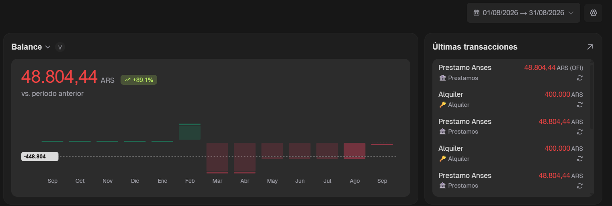

# ⚡ SpendBot Suite

> **Gestor Inteligente de Finanzas Personales Multiusuario** con Bot de Telegram (Gemini AI NLP) y Dashboard Web en Tiempo Real.



---

## 🚀 Características Principales

- 🤖 **Bot de Telegram con Inteligencia Artificial:** Registrá tus gastos diarios en lenguaje natural (ej: *"Gasté 4500 en la merienda"* o *"Mercado 12500 con tarjeta"*). Utiliza Google Gemini NLP para categorizar e interpretar los datos automáticamente.
- 🔗 **Sistema de Vinculación Seguro (`/start VIN-XXXX`):** Cada usuario registrado en la web recibe un código único para vincular su cuenta de Telegram de forma rápida y aislada.
- 👥 **Entorno Multiusuario Aislado:** Múltiples usuarios pueden registrar sus cuentas, ver sus propios balances y gestionar sus gastos sin interferencias.
- 📊 **Dashboard Web Financiero:**
  - Control de Balance total y mensual en pesos argentinos (ARS).
  - Gráfico interactivo de rendimiento mensual (perspectiva 13 meses).
  - Historial completo con filtros por fecha, tipo (gasto/ingreso) y categorías.
  - Programación de **Transacciones Recurrentes** (gastos fijos, servicios, préstamos).
- 🎨 **Diseño Moderno y Responsivo:** Construido con Tailwind CSS v4, componentes glassmorphism, modo oscuro sofisticado e interfaz fluida en móviles y escritorio.

---

## 🛠️ Tecnologías Utilizadas

- **Frontend / Dashboard:** Next.js 16 (App Router), React 19, Tailwind CSS v4, Lucide Icons.
- **Backend / Telegram Bot:** Python 3.11, `python-telegram-bot`, Google Gemini API.
- **Base de Datos:** SQLite (`better-sqlite3` en Node.js / `sqlite3` en Python).
- **Despliegue & Contenedor:** Docker, Dockerfile multi-stage, Docker Compose.

---

## 💻 Instalación y Uso Local

### 1. Clonar el repositorio
```bash
git clone https://github.com/matiexe/spendBot.git
cd spendBot
```

### 2. Configurar Variables de Entorno
Copiá la plantilla `.env.example` a `.env`:
```bash
cp .env.example .env
```
Completá tus credenciales en `.env`:
```env
TELEGRAM_BOT_TOKEN=tu_token_de_telegram
GEMINI_API_KEY=tu_api_key_de_gemini
SESSION_SECRET=secreto_para_cookies
PORT=3001
```

### 3. Ejecutar el Bot de Telegram (Python)
```bash
python -m venv .venv
source .venv/bin/activate # En Windows: .venv\Scripts\activate
pip install -r requirements.txt
python main.py
```

### 4. Ejecutar el Dashboard Web (Next.js)
```bash
cd dashboard
npm install
npm run dev
```
Abrí [http://localhost:3001](http://localhost:3001) en tu navegador.

---

## ☁️ Despliegue en Producción (Railway / Render con Docker)

El proyecto incluye un `Dockerfile` optimizado y el script `start.sh` para empaquetar tanto el Bot de Telegram como el Dashboard Web en un solo contenedor con soporte para **Volumen Persistente** de SQLite.

1. Conectá el repositorio en **Railway** o **Render**.
2. Seleccioná despliegue mediante **Dockerfile**.
3. Añadí las variables de entorno (`TELEGRAM_BOT_TOKEN`, `GEMINI_API_KEY`, `SESSION_SECRET`).
4. Asigná un **Volumen Persistente** montado en la raíz del proyecto para asegurar que `gastos.db` conserve los datos de los usuarios.

---

## 📄 Licencia

Este proyecto está distribuido bajo la licencia MIT.
